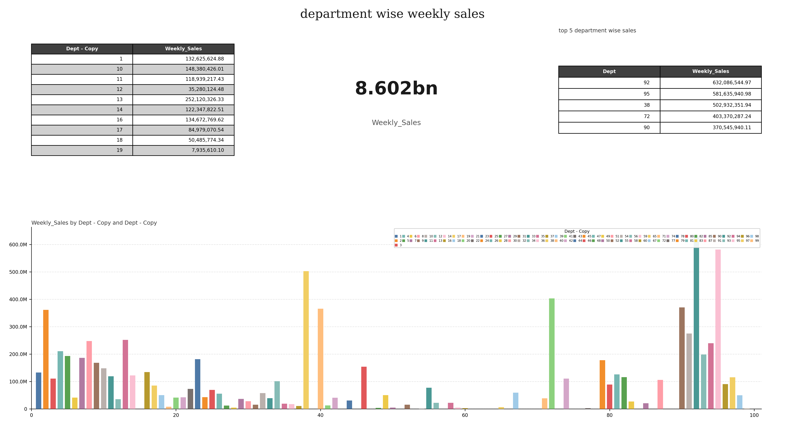
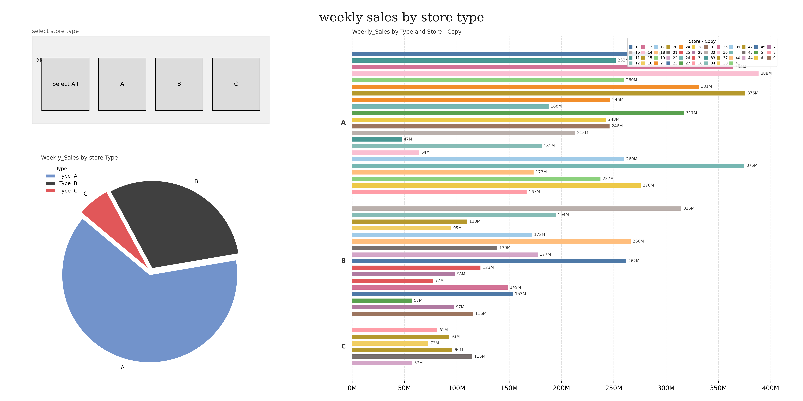

# 🚀 End-to-End Data Engineering Pipeline | Snowflake + dbt + Python

## 💡 What This Project Demonstrates

A **production-style data pipeline** that ingests raw data, transforms it using modern data stack tools, implements **SCD1 & SCD2 logic**, and delivers **analytics-ready insights**.

This is not just a dbt project — it’s a **complete data engineering workflow**.

---

## 🏆 Why This Stands Out

- 🔄 **Automated ingestion** using Snowpipe (event-driven via S3 + SQS)
- 🧠 **Advanced data modeling** with proper star schema design
- 🕒 **SCD Type 1 & Type 2 implementation** (real-world requirement)
- 🧪 **Data quality enforcement** using dbt tests
- 📊 **Analytics layer built in Python** (not just SQL outputs)
- 🏗 **Layered architecture** (Bronze → Staging → Integration → Gold)

---

## 🏗️ Architecture

```text
CSV → AWS S3 → Snowpipe → Snowflake (Bronze)
         ↓
       dbt (Staging → Integration → Gold)
         ↓
   Python Analytics (Matplotlib)
```

---

## ⚙️ Tech Stack

- **Cloud:** AWS S3  
- **Warehouse:** Snowflake  
- **Ingestion:** Snowpipe (SQS)  
- **Transformation:** dbt  
- **Programming:** Python (Pandas, Matplotlib)  

---

## 📂 Data Sources

| File | Description |
|------|------------|
| stores.csv | Store metadata (type, size) |
| department.csv | Department sales data |
| fact.csv | Store-level metrics (temperature, CPI, fuel, etc.) |

---

## 🧱 Data Modeling (Key Highlight)

### 🔹 Bronze
Raw ingestion from S3 (no transformation)

### 🔹 Staging
- Data cleaning
- Type casting
- Handling invalid values (e.g., 'NA')

### 🔹 Integration
- Business joins
- Grain alignment fixes
- Latest record tracking

### 🔹 Gold (Analytics Layer)

#### Dimensions (SCD1)
- `walmart_date_dim`
- `walmart_store_dim`

#### Fact Table (SCD2)
- `walmart_fact_table`
- Tracks history using:
  - `vrsn_start_date`
  - `vrsn_end_date`

---

## 🔄 SCD Implementation (Advanced)

### SCD Type 1
- Overwrites old data
- Used for dimension tables

### SCD Type 2
- Tracks historical changes
- Implemented using **dbt snapshots**
- Ensures:
  - One active record per key
  - No overlapping validity windows

---

## 📊 Analytics & Insights

### Key Analysis Performed:

- 📈 Weekly sales by temperature & year
- 🎯 Holiday vs non-holiday sales impact
- 🏬 Store performance comparison
- ⛽ Fuel price vs sales correlation
- 📉 Economic indicators (CPI, unemployment) impact

### 💡 Insights

- Moderate temperatures drive higher sales
- Holiday periods consistently increase revenue
- Larger stores contribute more but show variability
- Economic indicators influence customer spending

---

## 🧪 Data Quality & Testing

Implemented using dbt:

- ✅ Not Null checks
- ✅ Unique constraints
- ✅ Referential integrity
- ✅ SCD2 validation:
  - One active record per key
  - No overlapping time ranges

---

## 🚀 How to Run

```bash
# Upload data to S3
python ingestion/csv_s3_upload.py

# Run transformations
dbt run

# Run SCD2 snapshots
dbt snapshot

# Run data tests
dbt test

# Generate analytics
python analytics/sales_by_temp.py
```

---

## 📎 Repository Structure

```text
walmart-data-pipeline/
├── dbt/
├── ingestion/
├── analytics/
├── docs/
├── requirements.txt
└── README.md
```

---

## 📊 Sample Outputs





---

## 💼 What I Learned

- Designing scalable ELT pipelines
- Implementing SCD logic in dbt
- Handling real-world dirty data
- Building analytics-ready datasets
- Debugging data quality issues end-to-end

---

## 🔮 Future Improvements

- CI/CD with GitHub Actions
- Incremental dbt models
- Dashboard (Streamlit / BI tool)
- Data observability layer

---

## 👤 Author

Harneet Bagga

---

⭐ If you found this project interesting, feel free to star the repo!